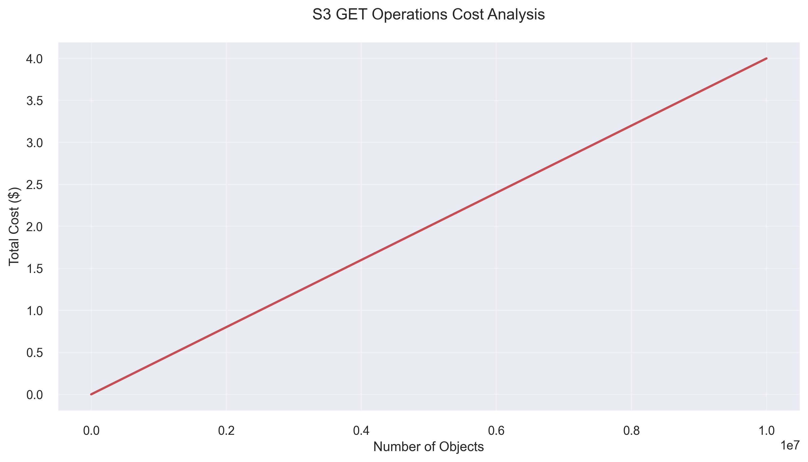
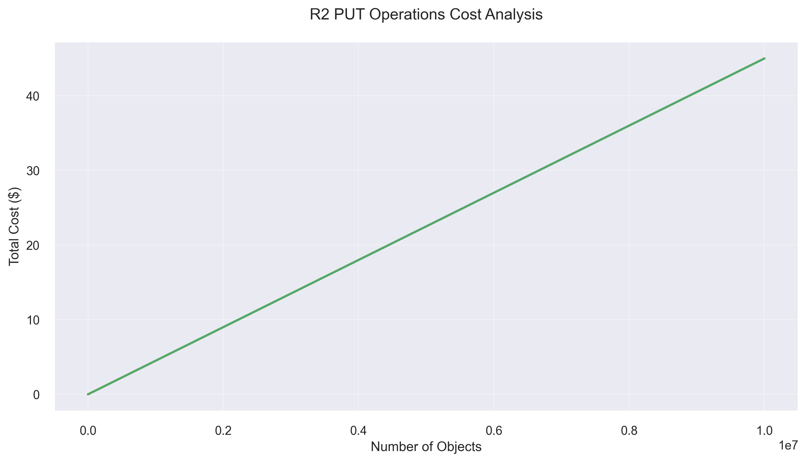

# Migration Cost Analysis

Before calculating the feasibility of using R2, let's first calculate the price of migration. To do this, divide the total price of migration into three main components:

1. S3 Egress Costs
2. S3 GET Operations Costs
3. R2 PUT Operations Costs

Then let's colсulate them independently and visualise the findings.

## Table of Contents
- [Migration Cost Analysis](#migration-cost-analysis)
  - [Table of Contents](#table-of-contents)
  - [Cost Formulas](#cost-formulas)
    - [S3 Egress Cost](#s3-egress-cost)
    - [S3 GET Operations Cost](#s3-get-operations-cost)
    - [R2 PUT Operations Cost](#r2-put-operations-cost)
  - [Cost Analysis Tool](#cost-analysis-tool)
  - [Key Findings](#key-findings)
  - [Cost Optimization Recommendations](#cost-optimization-recommendations)
  - [Limitations](#limitations)


## Cost Formulas

### S3 Egress Cost
The egress cost is calculated using tiered pricing:

\[
\text{Cost} = \sum_{i=1}^{n} \min(\text{remaining\_data}, \text{tier\_size}_i) \times \text{rate}_i
\]

Where:
- Tier 1 (0-10 TB): $0.09 per GB
- Tier 2 (10-50 TB): $0.085 per GB
- Tier 3 (50-150 TB): $0.07 per GB
- Tier 4 (>150 TB): $0.05 per GB

### S3 GET Operations Cost
\[
\text{Cost} = \frac{\text{number\_of\_objects}}{1000} \times \$0.0004
\]

### R2 PUT Operations Cost
\[
\text{Cost} = \frac{\text{number\_of\_objects}}{1,000,000} \times \$4.50
\]

## Cost Analysis Tool

`scripts/s3_to_r2_migration_calculator.py` - a Python script that calculates and visualizes these costs.

```bash
# Install dependencies:
pip install -r scripts/requirements.txt

# Run the calculator:
python scripts/s3_to_r2_migration_calculator.py

#Check the output and `images/` directory
```

The script generates several key visualizations:

1. **Individual Cost Components**:
   - S3 Egress Cost vs Data Size
   
   
   - S3 GET Operations Cost vs Number of Objects
   
   
   - R2 PUT Operations Cost vs Number of Objects
   

2. **Comparative Analysis**:
   - Stacked bar chart comparing total costs across different scenarios:
   - 
   | Scenario   | Data Size | Objects      | Total Cost  | Cost per TB |
   |------------|-----------|--------------|-------------|-------------|
   | Small      | 5.0 TB    | 100,000      | $461.29     | $92.26      |
   | Medium     | 50.0 TB   | 1M           | $4,408.10   | $88.16      |
   | Large      | 200.0 TB  | 10M          | $14,180.20  | $70.90      |
   | Hyperscale | 1000.0 TB | 50M          | $55,336.20  | $55.34      |
   | Enterprise | 2000.0 TB | 100M         | $106,781.20 | $53.39      |
   
   

## Key Findings

1. **Egress Costs**: The most significant cost component for large data migrations, with costs increasing linearly but at decreasing rates due to tiered pricing.

2. **GET Operations**: Relatively minor cost component, with costs scaling linearly with the number of objects. the requests in negligible small compare to the egress cost of AWS.

3. **PUT Operations**: Moderate cost component that scales linearly with the number of objects, but at a higher rate than GET operations. the requests in negligible small compare to the egress cost of AWS.

## Cost Optimization Recommendations

1. **Batch Operations**: Group objects into larger batches to reduce the number of operations.

2. **Tiered Migration**: Consider migrating data in phases to take advantage of S3's tiered egress pricing.

3. **Object Size Analysis**: Analyze object size distribution to optimize for both storage and operation costs.

4. **Free Tier Utilization**: Take advantage of R2's free tier (10GB storage + 1M Class A + 10M Class B operations) for initial migration testing.

> Source: [Super Spulper](https://developers.cloudflare.com/r2/data-migration/super-slurper/), [Sippy](https://developers.cloudflare.com/r2/data-migration/sippy/)

Cloudflare is well aware of the data migration problem and has designed two solutions for that:

1. Super Slurper: Move all your data from Amazon S3 or Google Cloud Storage to R2 in a single operation. It preserves custom object metadata from the source bucket by copying it to the migrated objects, and it does not delete any objects from the source bucket. This tool is fast but requires you to pay egress fees from the source provider.
   
2. Sippy: Incrementally migrate from S3 providers to Cloudflare R2 without paying unnecessary egress fees. When an object is requested, it is served from your R2 bucket if it is found. Otherwise, it is simultaneously returned from the source bucket and copied to R2 to minimize data transfer fees. All other operations, including insert and delete operations, continue to work as usual.
   
Both are free to use and charge only for the Class A operations that the tool needs to perform to transfer data to your R2 bucket.

## Limitations

1. The calculator assumes all objects are of similar size and access patterns.
2. Network transfer times and potential throttling are not considered.
3. Storage costs during the migration period are not included.
4. The analysis does not account for potential AWS data transfer discounts for enterprise customers.

