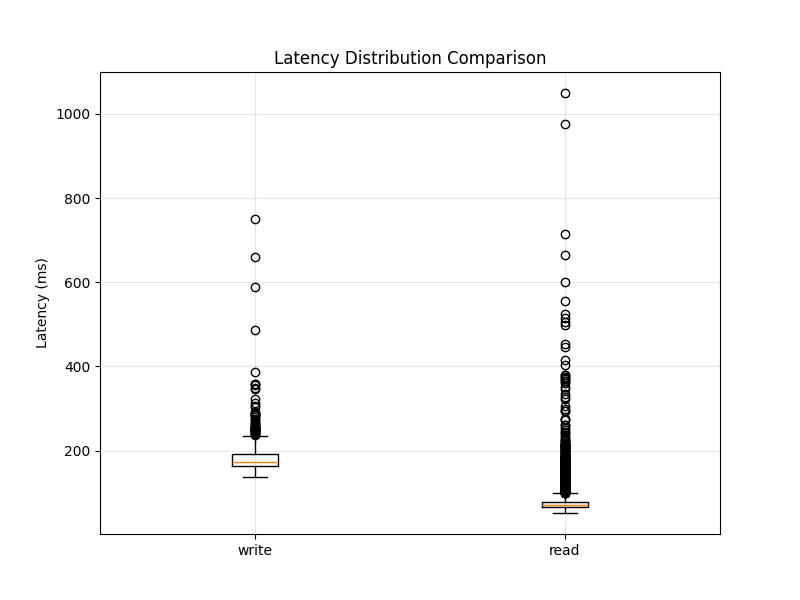
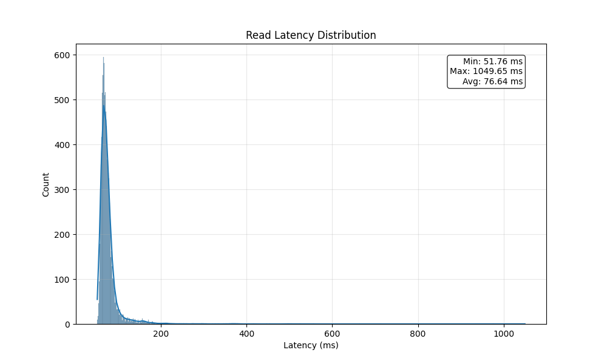
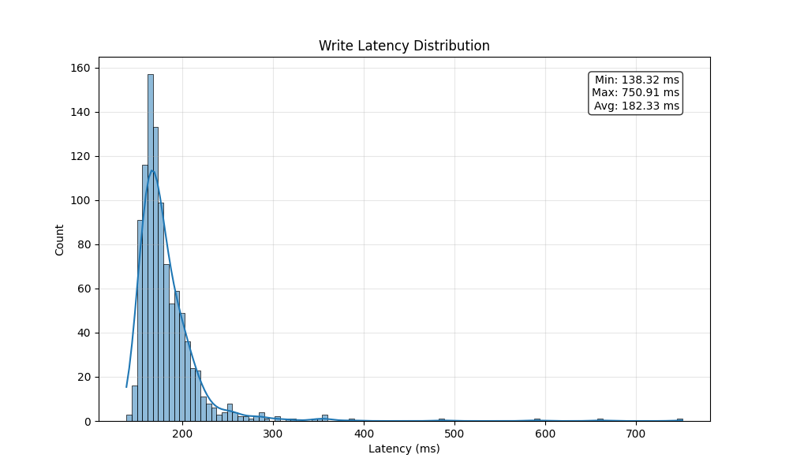
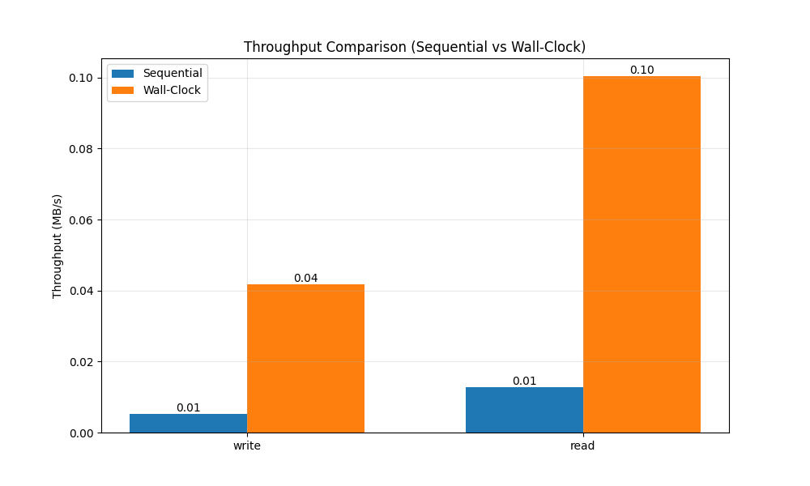

# Benchmarking

Although Cloudflare R2 is often more cost-effective than Amazon S3, cost alone shouldn’t drive our migration decision. We must confirm that R2 delivers performance on par with S3 so that the price gap isn’t the result of higher latency or lower throughput.

Our benchmark should therefore evaluate the entire end-to-end pipeline—not just R2’s raw object-storage performance, but also Cloudflare Workers and any computation running on external VMs. Specifically, we need to answer:
	•	Is Cloudflare R2 fast enough relative to S3?
	•	Does zero-egress pricing outweigh R2’s request fees?
	•	Should compute run on Cloudflare Workers or remain on traditional VMs?

Addressing these questions will show whether we can gain R2’s vendor-neutral benefits without sacrificing speed or incurring hidden costs.


## Existing benchmarking solutions

### Skyrise

In the BTW25 conference TU Berlin presented a "An Empirical Evaluation of Serverless Cloud Infrastructure for
Large-Scale Data Processing" paper. They performed a detailed analysis of the performance and cost characteristics of serverless infrastructure in the data processing contex. Moreover, they provided an open source framework that enables the integration of the additional benchmarks and cloud infrastructure.

> Our framework includes a comprehensive suite of microbenchmarks for serverless resources and integrates a serverless query engine to run application-level benchmarks. The framework automates the setup, execution, and result processing for the experiments in our evaluation. Hence, it enables the reproduction of our experimental results.


### Results 

| Service                     | Max Aggregate Throughput (Read / Write)            | IOPS (Read / Write) on New Setup | Read Latency (Median | p95) | Notes |
|----------------------------|-----------------------------------------------------|----------------------------------|----------------------|------|-------|
| S3 Standard                | ~250 / ~250 GiB/s (linear scaling with clients)     | ~8k / ~4k ops/s                  | ~27 ms | ~75 ms       | Highest tail latency; outliers >10 s. |
| S3 Express One Zone        | ~250 / ~250 GiB/s (similar scaling to Standard)     | ~220k / ~42k ops/s               | ~5 ms | ~5 ms        | Low and consistent latency; higher request cost. |
| DynamoDB (on-demand)       | ~0.38 / ~0.03 GiB/s (saturates early)               | ~16k / ~9.6k ops/s               | ~5 ms | (more variable) | Ultra-low median latency; poor bulk throughput/cost. |
| EFS (per filesystem)       | ~20 / ~5 GiB/s (hits per-FS quotas)                 | Well below per-FS quotas; limited scaling | ~5 ms | ~5 ms | Writes ~2–3× slower than reads; doubling with 2 FS only. |


#### Reuse

 Skyrise codebase a bit heavyweight for our needs, so we borrowed their overall setup and ideas but wrote a simpler microbenchmark from scratch. 
 It is implemented in the [direct_storage_benchmark.cpp](https://github.com/Frosendroska/skyrise/edit/no-brain-r2-microbenchmark/src/benchmark/bin/micro_benchmark/direct_storage_benchmark.cpp?pr=%2Fhpides%2Fskyrise%2Fpull%2F1) file in the [repo](https://github.com/hpides/skyrise/pull/1).

*Purpose:* Microbenchmark for measuring upload and download performance of Cloudflare R2 object storage using the AWS S3 SDK.
*Key Features:*
- Multi-threaded operations: Supports configurable thread counts for parallel uploads/downloads
- Two-phase testing:
    - Type A: Upload operations (writes)
    - Type B: Download operations (reads)
- Comprehensive metrics: Measures latency (min/max/avg), throughput, and wall-clock timing
- Configurable parameters: Object size, operation counts, number of runs, bucket/prefix settings
- Main Components:
    - R2Benchmark class handles AWS S3 client setup and benchmark execution
    - CLI interface using CLI11 library for parameter configuration
    - Thread-safe latency collection with mutex protection
    - Random data generation for test objects
*Usage:* The tool uploads objects to R2 storage, then downloads them while measuring performance metrics, making it useful for evaluating R2 storage performance characteristics under different workloads and configurations.

We run this script with the following parameters for the proof of concept:

```
Type A (upload) ops:    1000  
Type B (download) ops:  10000  
Object size:            1024 bytes (1 KB)  
Threads:                8  
Runs:                   1  
```

The results are in the (benchnark_plot/)[https://github.com/hpides/skyrise/tree/9d58f82f3c5ba39fe9e181fef4a984cdc49da731/benchmark_plots] folder:

#### Benchmark Summary Report






The low throughput is expected—it’s just a basic proof of concept. On top of that, the tests were run from a personal laptop, not from EC2 or R2 workers.

However, we now have an impression of the latency distribution and can build a more reliable microbenchmark. 


## Our benchmark solution

### Throughput banchmarks

Our next step is to run more comprehensive experiments from EC2, where we’ll store data in R2 and fetch it from the EC2 instance to test both microbenchmarking and throughput limits. The implementation and the design document are in `R2-bench/` folder.

The design document of this benchmarking is in (README.md)[R2-bench/README.md].

#### Results

- r5.xlarge (32 GiB, 4 vCPUs, EBS only, Up to 25 Gigabit, $0.298 hourly)
  - The results are in the [r5.xlarge](../plots/r5.xlarge/) folder.
    Summary:
    ```
    Total Records: 10,067
    Successful Requests: 10,067
    Success Rate: 100.00%

    Duration: 0.52 hours
    Total Data: 983.11 GB
    Average Throughput: 4532.2 Mbps

    Latency Statistics (ms):
    Average: 14806.8
    P50: 10931.4
    P95: 22053.1
    P99: 135819.5
    ```
    

- c5n.9xlarge (96 GiB, 36 vCPUs, EBS only, 50 Gigabit, $1.944 hourly)
  - The results are in the [c5n.9xlarge](../plots/c5n.9xlarge/) folder.
    Summary:
    ```

    ```
    

- c7gn.8xlarge (4 GiB, 32 vCPUs, EBS only, 100 Gigabit, $1.9968 hourly)
  - The results are in the [c7gn.8xlarge](../plots/c7gn.8xlarge/) folder.
    Summary:
    ```

    ```
    

- hpc7g.16xlarge (128 GiB,	64 vCPUs, EBS only, 200 Gigabit, $1.6832 hourly)
  - The results are in the [hpc7g.16xlarge](../plots/hpc7g.16xlarge/) folder.
    Summary:
    ```

    ```
    


